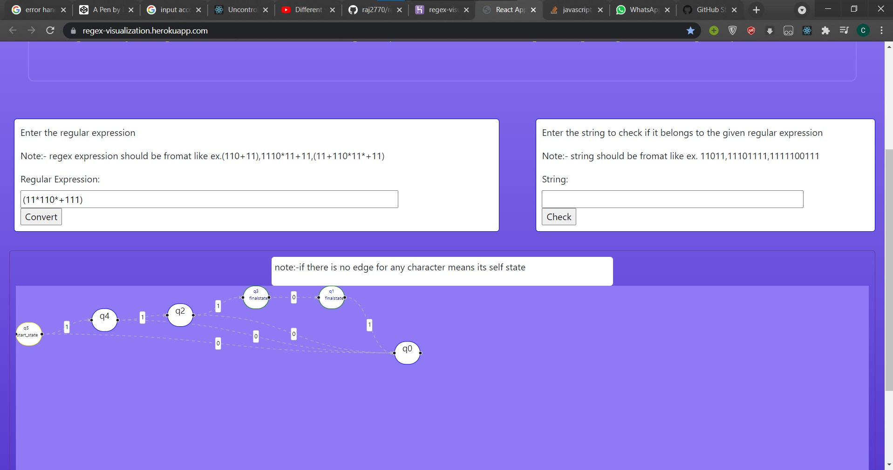
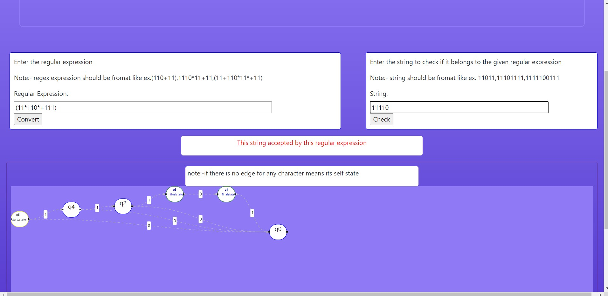
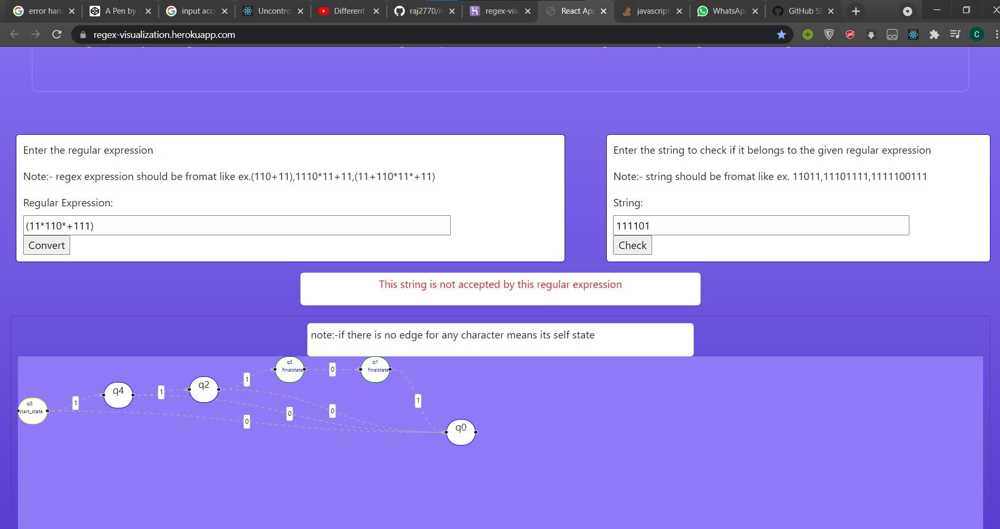

# regeular expression visualizer Tool

using this tool you can get the dfa graph of regular expression and you can check also that given string accepted or not by regular expresssion.

## Tool link
https://regex-visualization.herokuapp.com/

  
## demos




## Features

- you can draw dfa of reular expression 
- Live graph
- you  can check that given string accepted or not by regular expression
- Cross platform

  
## Running Tests

To run this project, run the following command

```bash
  npm run start
```

  
## Tech Stack

**Client:** React, javascript, toc concepts,dsa


  
## Support

For support, email cs19b034@iittp.ac.in .

  